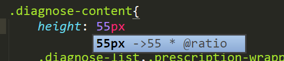

###cssunit
-------------

一个自动补齐指定单位的插件

插件效果如下：

##### 安装步骤

1.下载地址：https://github.com/FedWithMori/cssunit.git
2.进入packages目录：Sublime Text -> Preferences -> Browse Packages...
3.打开bash或者命令面板，git clone下来
4.重启Sublime Text。

##### 配置参数

参数配置文件：Sublime Text -> Preferences -> Package Settings -> cssunit

可配置的参数有两个：
1. unit --> 你想要的单位,默认为 * @ratio
2. available_file_types --> 你想要匹配的文件类型